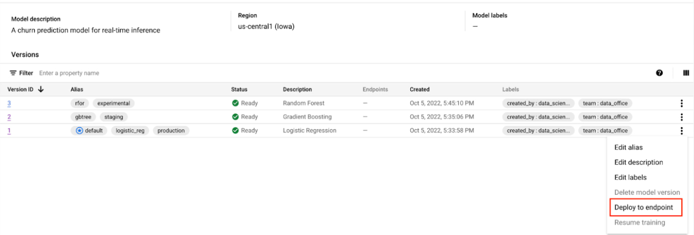

# Vertex AI Image Classifier (Community Content)

This project is adapted from Google Cloud’s Vertex AI samples.  
It demonstrates how to train and deploy a **PyTorch tabular classification model**  
using **Vertex AI Pipelines**.

## Folder Structure

Train_tabular_models_with_many_frameworks_and_import_to_Vertex_AI_using_Pipelines/  
└── Train_tabular_classification_model_using_PyTorch_and_import_to_Vertex_AI/  
  └── pipeline.py

## How to Run

1. Open the notebook or script.  
2. Set up your Google Cloud project and enable Vertex AI.  
3. Install dependencies (see `requirements.txt`).  
4. Run the pipeline to train and deploy the model.

## Credits

Based on samples from the [GoogleCloudPlatform/vertex-ai-samples](https://github.com/GoogleCloudPlatform/vertex-ai-samples) repository.

